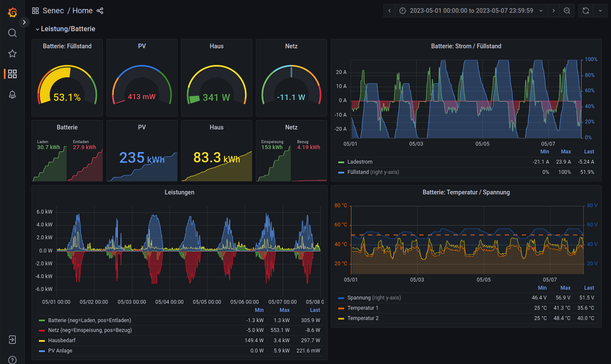
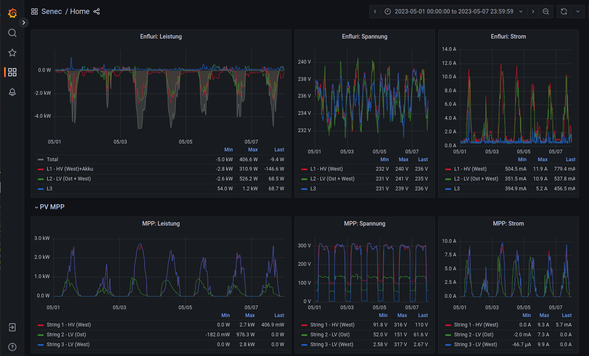
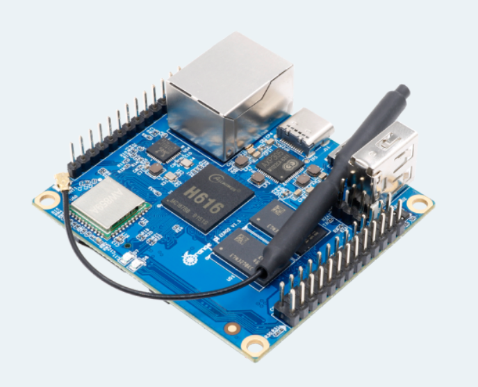
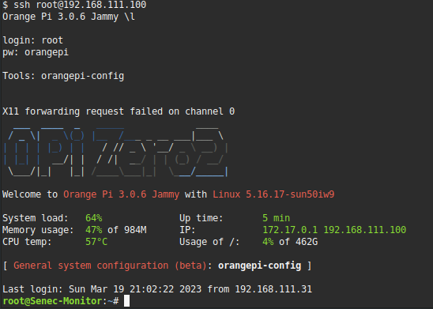
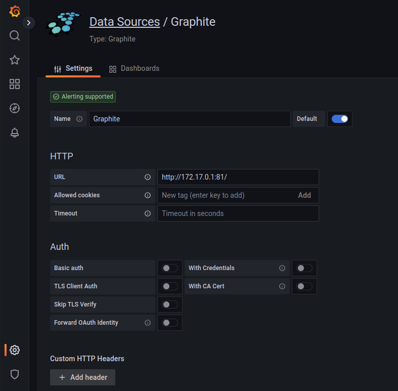

# SENEC.Home V3 hybrid Grafana monitor

 

Dieses Repo ist nur eine kleine Sammlung an Infos,
um ein Monitor via Grafana für SENEC.Home V3 hybrid/duo aufzubauen.

Unsere Senic hatte einen zusätzlichen Wechselrichter eingebaut, um 3 Strings
zu bedienen. Daher enthält das Dashboard 3 MPPs.

Aufgebaut habe ich das mit:
- Orange Pi Zero 2 (sollte auf jeden Linux system funktionieren)
- Docker Image: Grafana
- Docker Image: graphite (Datenbank)
- SD Card
- SSD Disk

 

Die SDCard wird zum Booten des OrangePi verwendet. Die gesamte Installation erfolgte im ersten Schritt auf der SDCard.
In einem späteren Schritt, habe ich diese auf die SSD komplett kopiert, das Filesystem erweitert, einen neue ID für die SSD vergeben und in der Bootconfig (/boot/...) das Root-FS auf die SSD gestellt. Grund ist, dass eine SSD für die vielen Schreibzugriffe optimiert ist und eine SDCard nach kurzer Zeit kaputt geht.

Ich werde hier nur Anhaltspunkte geben und meine Scripts beschreiben. Infos
zur Installation oder das Clonen auf eine SSD+Anpassung von /boot/... lassen
sich gut im Internet suchen. Grund, wir haben keinen Senec-Speicher mehr, so
dass hier auch keine weiteren Updates erfolgen. 

## Arbeitsweise
Nach dem Booten werden die beiden Docker-Images und das senec.sh script gestartet.
Das script ruft periodisch die webseite des gerätes ab (genauer gesagt nur die daten) und schiebt diese in die graphite Datenbank. 
Grafana ruft diese Daten ab und stellt diese dar.

# Schritte
- Installieren eines Linux auf OrangePi. Es gehen auch andere Boards wie RaspberryPi, oder auch VM.
Der OrangePi braucht dafür Internetzugang. Netzwerk kann wie beim RaspberryPi
mit einem ähnlichen Tool konfiguriert werden.
- docker für Grafana und Graphite konfigurieren und starten (start-docker.sh)
- OrangePi so konfiguieren, dass es beim booten automatisch "senec.sh" startet, um Daten zu sammeln

## Notwendige Pakete

~~~sh
# docker
apt install docker.io

# nc (netcat Netzwerktool um Daten zu senden)
apt install netcat

# jsc (java script command line interpreter)
apt install libjavascriptcoregtk-4.0-bin

# jq (json command line parser)
apt install jq

# curl (um Daten von senec abzurufen)
apt install curl
~~~

## Einrichtung Grafana
~~~sh
# docker image laden
docker pull grafana/grafana-oss

# Das Datenverzeichniss für Grafana habe ich im Homeverzeichniss von Root
mkdir -p /root/grafana/data

# start docker as deamon. das fuellt auch das datenverzeichniss
docker run --name grafana -u $(id -u) -d -v "/root/grafana/data:/var/lib/grafana" -p 80:3000 grafana/grafana-oss

# commando zeile des containers:
docker exec -ti grafana bash

# admin passwort zueruck gesetzt auf "admin" . beim login wird dann nach neuem passwort gefragt, was aber aber "geskipped" werden kann (jedes mal)
grafana-cli admin reset-admin-password "admin"
~~~

 Weitere Infos: grafana-cli: https://grafana.com/docs/grafana/v9.3/cli/

### Plugins
Wenn Graphana läuft, muss dort noch das Plugin "Graphite" installiert werden, damit dieses als
Data-Source verfügbar ist.
- Plugin Graphite installieren
- Datasource konfigurieren (images/grafana-data-sources.png)
- Configuration-Preferences "Home Dashboard" wählen damit es als default erscheint

### Konfiguration
Datasource is graphite, weil ich da Daten einfach pushen kann.
Die Datenbank wird erst mit dem ersten Pushen angelegt. Das Schema wie
die Daten in welcher Auflösung gespeichert werden, sind in *graphite-data/graphite/conf/storage-schemas.conf* definiert.

Als IP für die Datensource kann ich nicht localhost nehmen, da Grafana oder graphite im docker laufen und ihr eigenes localhost haben.

**Lösung**: die IP von docker nutzen 172.17.0.1 (siehe images/grafana-data-sources.png) 
Alle docker instancen, nutzen ein eigenes Netz im Bereich 172.17.x.x was
durch docker selbst angelegt wurde.

Das Dashboard von Grafana ist normaler erst nach Login erreichbar. Um es ohne Login (readonly) zu erreichen, muss es öffentlich gemacht werden. 
Das muss innerhalb des Containers von grafana gemacht aktiviert werden.
Infos: https://grafana.com/docs/grafana/v9.3/setup-grafana/configure-security/configure-authentication/

Es ist wichtig, dass **org_name** mit dem vom Dashboard übereinstimmt, sonst kommt immer die "login" Seite.
Siehe dazu: http://<ip>/admin/orgs

~~~sh
# um eine shell im laufenden container zu bekommen
root@Senec-Monitor:~# docker exec -it grafana bash
~~~

**config-file**: /usr/share/grafana/conf/default.ini
~~~sh
#################################### Anonymous Auth ######################
[auth.anonymous]
# enable anonymous access
enabled = true

# specify organization name that should be used for unauthenticated users
org_name = Senec

# specify role for unauthenticated users
org_role = Viewer

# mask the Grafana version number for unauthenticated users
hide_version = false
~~~

## Dashboard
Das Dashboard kann als Json in Grafana importiert werden. Dieses enthält alles was zur Anzeige benötigt wird.
Via Webfrontend unter Dashboards:
- Erzeugen eines neuen Ordners "Senec"
- via "New" das dashboard json importieren

## Graphite (Datenbank)

Beim initialen Start des Containers "bind-mounte" ich das Datenverzeichnis in den Container,
damit ich die Daten immer habe und leichter sichern kann.

Die Darstellung der Daten erfolgt via Grafana, da das deutlich besser ist. Zur Fehlersuche kann aber auch direkt auf die Webseite von graphite zugegriffen werden.
http://<ip>:81/

~~~sh
GRAPHITE_BASE="/root/graphite-data"
mkdir -p ${GRAPHITE_BASE}/statsd/config ${GRAPHITE_BASE}/graphite/storage ${GRAPHITE_BASE}/graphite/conf

docker run -d \
 --name graphite \
 --restart=always \
 -v ${GRAPHITE_BASE}/graphite/conf:/opt/graphite/conf \
 -v ${GRAPHITE_BASE}/graphite/storage:/opt/graphite/storage \
 -v ${GRAPHITE_BASE}/statsd/config:/opt/statsd/config \
 -p 81:80 \
 -p 2003-2004:2003-2004 \
 -p 2023-2024:2023-2024 \
 -p 8125:8125/udp \
 -p 8126:8126 \
 graphiteapp/graphite-statsd
~~~

Beim Starten des Containers werden alle notwendigen Files in diesem gemounteten Ordner
angelegt. Das Konfig-file, welches die Auflösung der Daten und den Umfang definert ist im file /root/graphite-data/graphite/conf/storage-schemas.conf hinterlegt. 
Dieses sollte dann angepasst werden und kann hier aus dem Repo entnommen werden.

Da die Datenbank normalerweise leer ist und noch keine Daten enthält, kann die Konfiguration
nach dem Starten der Container erfolgen, nach dem dieser die notwendigen Files angelegt hat.

Der docker container muss anschließend neu gestartet werden, damit diese Konfiguration aktiv wird.

**Hinweis**: Ich habe im Nachgang versucht, die Datenbank bezüglich der Auflösung für bestimmte Zeitperioden anzupassen. Das hat nicht so richtig funktioniert. Daten sind dabei teilweise verloren gegangen. 
Daher sollte beim ersten Konfigurieren des Datalayouts von graphite gut geplant werden. Die Konfigs, die ich hier im Repo habe, sind aber eine gute Variante.

Generell wenn /opt/graphite/conf/storage-schemas.conf angepasst wird,
müssen auch die *wsp (Datenfiles) angepasst werden.
https://linuxboss.wordpress.com/2016/11/04/adjusting-retention-time-for-graphite-carbon-and-updating-whisper-files/

~~~sh
# shell in den container
docker exec -it graphite bash

# Anzeigen der aktuellen db info
/opt/graphite/bin/whisper-info.py /opt/graphite/storage/whisper/senec/state.wsp
~~~

Wenn authorisation auf die Datenbank gebraucht wird (was ich hier auf in so einer installation nicht brauche):
https://graphite.readthedocs.io/en/1.1.10/config-local-settings.html?highlight=authorize#dashboard-authorization-configuration  
~~~sh
docker exec -it graphite sh
# und dann die /opt/graphite/webapp/graphite/local_settings.py anpassen (DASHBOARD_REQUIRE_AUTHENTICATION)
~~~

# Booting
Beim Booten des OrangePi muss das *senec.sh* automatisch starten. Die Docker-Container werden bereits automatisch gestartet. 
Dazu muss in /etc/rc.local das script eingebunden werden (einfachster Weg). Falls bereits eigene Änderungen
gemacht wurden, dann die entsprechende Zeilen aus der rc.local (im repo) dort einfügen.

Das Scirpt *senec.sh* enthält eine Variable für die IP der Senec Anlage, welche darin noch angepasst werden muss (SENEC_IP).

## Sonstiges

Werden Anpassungen innerhalb eines Containers gemacht, müssen die services neu gestartet werden. Das kann man innerhalb des containers mit dem Kommando "sv" machen, oder ausserhalb den container via docker neu starten.

~~~sh
# Beispiel
sv stop graphite

# oder ausserhalb:
docker restart grafana graphite
~~~

Das *backup.sh* Script erlaubt es, ab und zu ein manuelles Backup zu machen. ;-)

Auf dem Gerät laufen zum Schluss zwei docker container und das senec.sh script, wenn alles läuft.

~~~sh
root@Senec-Monitor:~# docker ps
CONTAINER ID   IMAGE                         COMMAND         CREATED         STATUS        PORTS                                                                                                                                                                       NAMES
5698dab0e0db   graphiteapp/graphite-statsd   "/entrypoint"   10 months ago   Up 3 months   0.0.0.0:2003-2004->2003-2004/tcp, 2013-2014/tcp, 8080/tcp, 0.0.0.0:2023-2024->2023-2024/tcp, 0.0.0.0:8126->8126/tcp, 8125/tcp, 0.0.0.0:8125->8125/udp, 0.0.0.0:81->80/tcp   graphite
ed20ac7f24a5   grafana/grafana-oss           "/run.sh"       10 months ago   Up 3 months   0.0.0.0:80->3000/tcp
~~~
